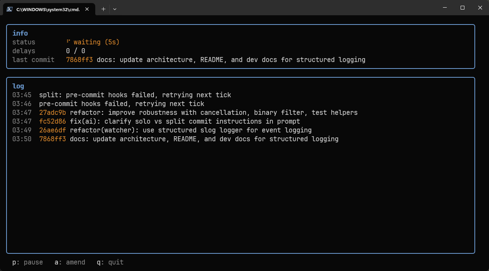

# quill-commit

**Automatic git commits powered by an LLM.** Watches your repo, waits for changes to stabilize, and commits them with a proper Conventional Commit message — without interrupting your flow.

[](https://github.com/elev1e1nSure/quill-commit/releases)
[](https://go.dev)
[](LICENSE)

---



---

> **This tool commits to your repo automatically.** It stages only the changes that pass its filters and writes them to your local git history without manual review. You are responsible for every commit. Use with caution on shared or protected branches.

## How it works

You write code. quill-commit watches `git diff`, waits for the pace to slow down, then asks an LLM: *is this a coherent unit of work?* If yes — it commits with a generated [Conventional Commit](https://www.conventionalcommits.org) message. If the diff contains several independent changes, it splits them into sequential atomic commits. If the model keeps saying *not yet* — after a configurable number of retries, it commits anyway so nothing gets lost.

If a pre-commit hook blocks the commit, quill-commit stays silent on unchanged diffs and asks the model to explain what went wrong — the explanation appears in the TUI.

No heuristics. No line-count thresholds. The model sees your actual diff and decides.

## Secret filtering

Three independent layers prevent credentials from reaching the LLM or being committed:

1. **Path filter** — hardcoded exclusions for known secret files: `.env`, `.env.*`, `*.pem`, `*.key`, `*_rsa`, `*.p12`, `credentials*`, `secrets*`. Add your own patterns in `.quillignore` (gitignore syntax).
2. **Content scan** — scans added lines and untracked files for known token signatures: OpenRouter `sk-or-v1-`, AWS `AKIA`, GitHub `ghp_`/`ghs_`, Slack `xox...`, Google `AIza`. A single match excludes the entire file.
3. **Staging guard** — replaces `git add -A` with targeted `git add -- <safe-files>`. Even if a file slips through the diff layer, it is never staged.

If the working directory contains **only** blocked files, quill-commit enters *quarantine*: it skips silently (one log message) and waits for normal code changes before resuming.

See `.quillignore.example` for a ready-to-use template.

## Install

```sh
go install github.com/elev1e1nSure/quill-commit@latest
```

Or build from source:

```sh
git clone https://github.com/elev1e1nSure/quill-commit
cd quill-commit
just build
```

## Quickstart

Get a free API key from [openrouter.ai](https://openrouter.ai), then:

```sh
quill-commit --api-key <your-key>
```

The key is saved automatically. Next time just:

```sh
quill-commit
```

## Presets

Three built-in rhythm presets cover most workflows:

| Preset | Check every | Re-check every | Max retries | Best for |
|--------|-------------|----------------|-------------|----------|
| `active` *(default)* | 2 min | 1 min | 3 | Normal coding sessions |
| `deep` | 5 min | 2.5 min | 2 | Long focused work, big refactors |
| `aggressive` | 30 sec | 15 sec | 4 | Fast feedback loops |

```sh
quill-commit --preset aggressive
```

You can also tune individual values in `quill.toml` without using a preset.

## TUI controls

| Key | Action |
|-----|--------|
| `p` | Pause / resume |
| `a` | Manually trigger AI amend on the last commit |
| `q` / `ctrl+c` | Quit (double-press to confirm) |
| `ctrl+o` | Toggle full error detail when a commit is blocked |

The TUI shows the current state, next-check timer, retry counter, and a scrollable log of commits and errors. Routine operational events (checks, delays, model decisions) are shown in the status bar only — the log stays clean.

## Configuration

`quill.toml` is created automatically in your repo root on first run:

```toml
model            = "deepseek/deepseek-v4-flash"
interval         = 2      # minutes between checks
stabilize        = 1      # re-check cadence while diff is still changing (minutes)
max_delays       = 0      # force-commit after this many model "wait" responses (0 = never)
include_context  = true   # send project context (README, packages, recent commits) to model
context_budget   = 32000  # max chars of static context (truncated if exceeded)
recent_commits   = 10     # recent commit messages included in context
session_id       = ""     # OpenRouter session routing hint (auto-generated)
```

All CLI flags override `quill.toml` and are persisted back to it.

### CLI flags

| Flag | Description |
|------|-------------|
| `--api-key <key>` | OpenRouter API key |
| `--preset <name>` | Apply a named preset (`active`, `deep`, `aggressive`) |
| `--model <name>` | LLM model to use |
| `--interval <mins>` | Check interval in minutes |
| `--stabilize <mins>` | Stabilization re-check interval |
| `--max-delays <n>` | Max retries before forced commit |
| `--version` | Print version and exit |

## API key resolution

First match wins:

1. `--api-key` flag
2. `QUILL_API_KEY` environment variable
3. Credentials file: `~/.config/quill-commit/credentials` (Linux/macOS) or `%APPDATA%\quill-commit\credentials` (Windows)

## Logs

`log.txt` is written to the repo root using structured `log/slog` (text format). It captures every watcher event with level, timestamp, event kind, and — for errors — the raw error detail. The file is gitignored automatically and never committed.

Filter by level for debugging:

```sh
grep "level=ERROR" log.txt
grep "level=WARN"  log.txt
```

## Release notes

Generate AI-powered release notes from git history:

```sh
just release-notes FROM=v1.0.0 TO=v1.1.0
# or directly:
go run ./cmd/releasenotes --from=v1.0.0 --to=v1.1.0 --api-key <key>
```

## Docs

- [Architecture](docs/architecture.md) — watcher logic, stabilization, LLM loop, security design
- [Development](docs/development.md) — build, test, lint, release
